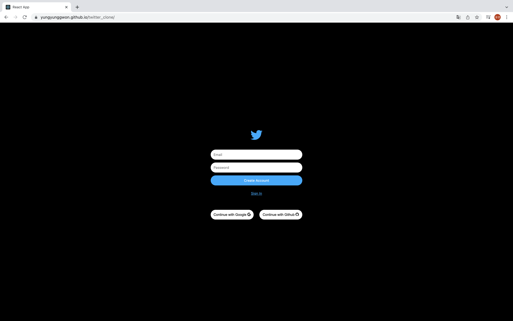
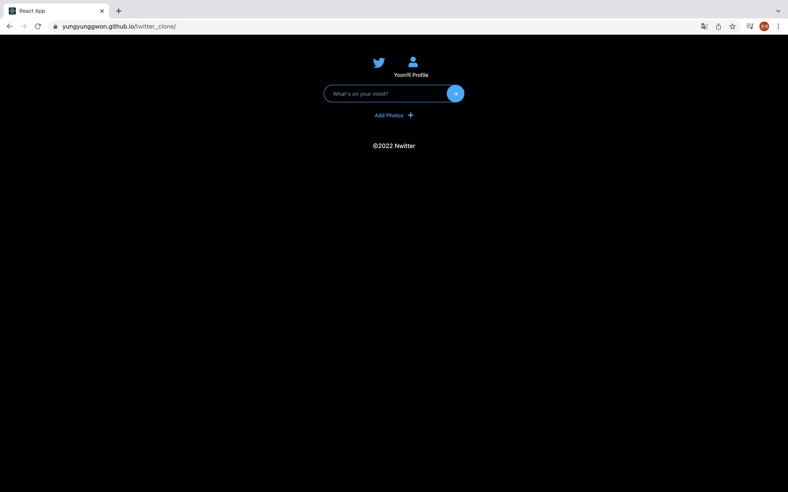
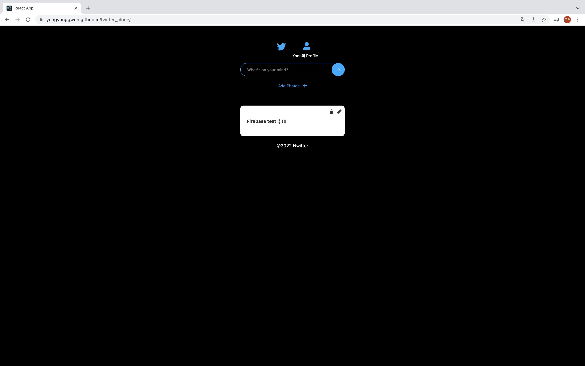

# Twitter_clone

프로젝트 보러가기 : https://yungyunggwon.github.io/twitter_clone/

## 프로젝트 목표
Firebase를 활용한 트위터 클론코딩

## 프로젝트에 사용한 기술
Javascript, CSS3, React, Firebase

## 프로젝트 기능 설명

* Main page

###### 로그인 전
 
</img>

###### 로그인 후
 
</img>

###### 글 작성 
 
</img>
